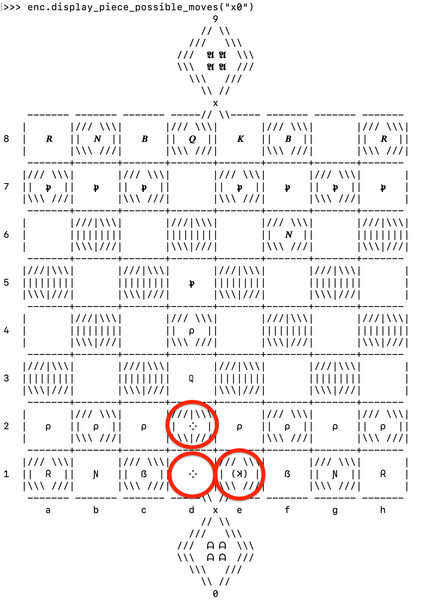

# EN-Chess
Fully operational proof of concept for a new chess variant!

The goal of creating this game is to modify chess in a way that is not too dissimilar from classic chess but also introduces some exciting new properties and possibilities. The emphasis is on changing a few assumptions of gameplay rather than requiring the user to learn patterns of movement of exotic pieces (one new piece is introduced, but its movement is more or less familiar), thus having a short learning curve. The dimensions of the board are nearly unchanged.

The code in this repository also easily allows adding more variants, introducing pieces and properties as necessary--initially accommodating just standard and EN chess but opening the door to more in the future. A rudimentary representation of the board and available moves is included as a minimalist way to visually execute and explore gameplay. (Unicode required.) The main code could also serve as an "API" upon which GUI improvements would be possible.
  * For now, gameplay can be operated via a simple interface by running `python3 enchess.py` or equivalent from a command line. To play with a friend, both players can sit at the same screen running the script, or one could screenshare remotely while the other player instructs the first on their moves to be entered.
  * Unfortunately, I found the Unicode chess-piece symbols to be too small to use, so for greatest contrast I have selecting interesting abbreviation characters for each piece/color.

_I claim ownership of the ideas and associated code in this repository._

## Rules of EN Chess:
_Similar to classic chess, with the following changes:_
* **_x_ squares:** The board has two extra squares, _x0_ and _x9_, where _x0_ shares a corner with _d1_ and _e1_ and _x9_ shares a corner with _d8_ and _e8_. The _x_ squares do not share an edge with any other square--thus excluding any rook-like movement--but are considered diagonal-only to both of their neighboring _d_ and _e_ squares. Note the following effects of _x_ squares:
  * Bishops can switch their square color in EN Chess as long as they pass through an _x_ square
  * A Bishop or Queen can claim two diagonals of different square color while at an _x_ square.
  * Rooks are the only piece that can never occupy and _x_ square.
* **Pawn promotion:** When a Pawn reaches the end of the board, it can only promote to a King (allowing the possibility of multiple Kings!) or an Auror, unless it forgoes promotion and waits at least one extra move as a Pawn, at which point it may expend a move to promote to any piece. If a Pawn captures a piece on an _x_ square, it must promote on the same move and can promote to any piece other than a Rook (which would be useless in an "x" square).
* **Aurors:** A new _Auror_ piece is introduced, starting with one per player in the _x_ square behind the army. Aurors move similarly to a King (one space in any of the eight directions) or identically to a Knight (they are quite mobile). However, Aurors _cannot capture pieces_ but rather exert influence in other ways:
  * **Penetration mode:** If a long-range piece (Bishop, Rook, or Queen) is adjacent (in any of the eight directions) to more friendly Aurors than enemy Aurors (e.g. only the starting Auror of the same army), then it gains the power of _Penetration_, where in a single move it can both capture and pass through one enemy piece, continuing in the same direction as far it chooses and potentially capturing one additional piece before stopping. Note that a Penetration-mode piece can check an enemy King if it is only blocked by one of its own pieces.
  * **Stunted mode:** If a long-range piece (Bishop, Rook, or Queen) is adjacent (in any of the eight directions) to more enemy Aurors than friendly Aurors (e.g. only the starting enemy Auror), then it loses its long-range abilities, only moving one square at a time in any of the directions it would normally move.
  * **King-Auror swaps:** Aurors can also _swap places with a King of the same army at any time_, often acting as an escape mechanism or perhaps to plant an Auror in a location that thwarts enemy movement. (In the case of multiple Kings or Aurors, _any_ Auror can swap places with _any_ King of the same army.)
* **Check and checkmate:** To accommodate the case of multiple Kings, the nature of check is adjusted according to the following rules:
  * **Legal moves:** If any King of the current player is in check, the only legal moves are those that _decrease the number of checked Kings_ (not necessarily to zero).
  * **Checkmate and Partial Checkmate:** If no such move is available, the result is dependent upon the number of Kings in check. If _all_ Kings of this player are in check, this is checkmate, and the checking player wins. If the number is any fewer, the checked player _loses a turn_, allowing the option of the checking player to _capture a King_ or make any other legal move. (Technically, two Kings could be captured in one move if there is a piece in Penetration mode!)
* _**TBD - Pawn movement** (possible additional change to encourage more frequent promotion to Kings/Aurors): Pawns can move either one or two spaces in the forward direction at any time rather than just on the second/seventh rank; two-space jumps are vulnerable to_ en passant _capture whenever an enemy pawn is immediately left or right of the final location._

## Getting started
The code does not require any installation after download. For non-Python-savvy users, an easy sequence of steps to get started is as follows.

1. Decide how to run the file. `macOS` should automatically come with Python 3. I think many versions of Linux as well. If the next steps reveal that you _do not_ have Python 3, a probably-no-hassle method is to use an online compiler (I found that this one works well: https://www.codingrooms.com/compiler/python3). Another method that should be pretty easy is just to install Python 3: https://www.python.org/downloads/
2. Download the `enchess.py` file (or copy and paste into the online compiler, replacing any default code).
3. (probably not necessary for online compilers) On your console (_Terminal_ app on `macOS`; Command Prompt on Windows), navigate to the folder containing the file by entering `cd {folder name}`
  * e.g. `cd downloads`
4. Run the script.
  * on Mac: `python3 enchess.py` (similar on Windows; might be plain `python` depending on how you've set it up)
  * Online compiler: There will probably be a "Run" or "Execute" button—-just press that.
6. See below for gameplay!

## Usage and Gameplay
Running the script initiates the game. Any command can be entered using the following format, separating arguments by spaces:
```
function_name arg1 arg2...
```

Even easier: the most important function to know is `move`, whose name you do _not_ have to specify as the script will assume you want to move if you _start your command with a piece location_. For example, all you have to do to "move the piece at _d2_ to _d4_" is the following command: `d2 d4`

Other functions, whose names _do_ need to be specified as the first argument, include the following, with arguments included below (optional arguments shown in `[square brackets]` along with their default value). These would be avoided in a competitive game but can help during the learning curve (and have been helpful for debugging purposes).
* `display_piece_possible_moves piece_loc [perspective="White"]` - Annotate the board with all possible moves for the piece at the specified location.
* `display_possible_moves_by_piece [perspective="White"]` - For each of the current player's pieces, display the board, annoted with all possible moves of that piece.
* `list_piece_possible_moves piece_loc` - List all possible moves for the piece at the specified location.
* `list_all_possible_moves` - List all of the current player's possible moves.
* `list_checks` - Provide a check status of `True` or `False` for each King on the board.

### Turns and piece movement
The `move` function will prevent illegal moves, advance the game as necessary, and then display the board from the perspective of whichever player is up next. Pieces are specified by their current location on the board. For example:


### Displaying possible moves (EN Chess examples)
The possible moves of White's Auror are shown below for a board where White's Queen has been developed. This opens up the _d1_ (King-like movement) and _d2_ (Knight-like movement) squares; note as well that White's King is shown in parentheses to indicate the availability of a King-Auror swap move.

