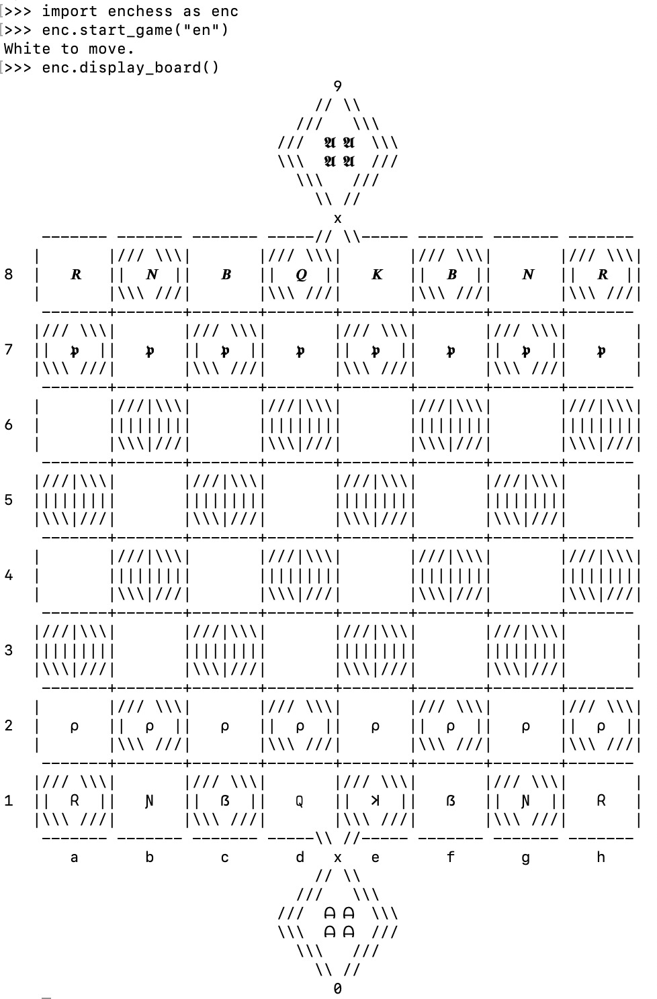

# EN-Chess
Proof of concept for a new chess variant!

The goal of creating this game is to modify chess in a way that is not too dissimilar from classic chess but also introduces some exciting new properties and possibilities. The emphasis is on changing a few assumptions of gameplay rather than requiring the user to learn patterns of movement of exotic pieces, thus having a short learning curve. The dimensions of the board are nearly unchanged.

The code in this repository also easily allows adding more variants, introducing pieces and properties as necessary--initially accommodating just standard and EN chess but opening the door to more in the future. A rudimentary representation of the board and available moves is included as a minimalist way to visually execute and explore gameplay. (Unicode required.)
  * For now, gameplay can be operated in a Python prompt/shell by calling simple Python functions to change the state of the game.
  * Unfortunately, I found the chess-piece symbols to show up too small to use, so for greatest contrast I have selecting interesting abbreviation characters for each piece/color.

_I claim ownership of the ideas and associated code in this repository._

## Rules of EN Chess:
_Similar to classic chess, with the following changes:_
* **_x_ squares:** The board has two extra squares, _x0_ and _x9_, where _x0_ shares a corner with _d1_ and _e1_ and _x9_ shares a corner with _d8_ and _e8_. The _x_ squares do not share an edge with any other square (thus excluding any rook-like movement) but are considered diagonal-only to both of their neighboring _d_ and _e_ squares. _Note that this means Bishops can, in fact, switch their square color if they pass through an x square, and a Bishop or Queen can claim two diagonals of different square color while at this location._
* **Pawn promotion:** When a Pawn reaches the end of the board, it can only promote to a King (allowing the possibility of multiple Kings!) or an Auror, unless it forgoes promotion and waits at least one extra move as a Pawn, at which point it may expend a move to promote to any piece. If a Pawn captures a piece on an _x_ square, it must promote on the same move and can promote to any piece other than a Rook (which would be useless in an "x" square).
* **Aurors:** A new _Auror_ piece is introduced, starting with one per player in the _x_ square behind the army. Aurors move similarly to a King (one space in any of the eight directions) or identically to a Knight (they are quite mobile). However, they _cannot capture enemy pieces_ but rather exert influence in other ways:
  * **Penetration mode:** If a long-range piece (Bishop, Rook, or Queen) is adjacent (in any of the eight directions) to more friendly Aurors than enemy Aurors (e.g. only the starting Auror of the same army), then it gains the power of _Penetration_, where in a single move it can both capture and pass through one enemy piece, continuing in the same direction as far it chooses and potentially capturing one additional piece before stopping. Note that a Penetration-mode piece can check an enemy King if it is only blocked by one of its own pieces.
  * **Stunted mode:** If a long-range piece (Bishop, Rook, or Queen) is adjacent (in any of the eight directions) to more enemy Aurors than friendly Aurors (e.g. only the starting enemy Auror), then it loses its long-range abilities, only moving one square at a time in any of the directions it would normally move.
  * **King-Auror swaps:** Aurors can also _swap places with a King of the same army at any time_, often acting as an escape mechanism or perhaps to plant an Auror in a location that thwarts enemy movement. (In the case of multiple Kings or Aurors, _any_ Auror can swap places with _any_ King of the same army.)
* **Check and checkmate:** To accommodate the case of multiple Kings, the nature of check is adjusted according to the following rules:
  * **Legal moves:** If any King of the current player is in check, the only legal moves are those that _decrease the number of checked Kings_.
  * **Checkmate and Partial Checkmate:** If no such move is available, the result is dependent upon the number of Kings in check. If _all_ Kings of this player are in check, this is checkmate, and the checking player wins. If the number is any fewer, the checked player _loses a turn_, allowing the option of the checking player to _capture a King_ or make any other legal move. (Technically, two Kings could be captured in one move if there is a piece in Penetration mode!)
* _**TBD - Pawn movement** (possible additional change to encourage more frequent promotion to Kings/Aurors): Pawns can move either one or two spaces in the forward direction at any time rather than just on the second/seventh rank;_ en passant _is possible on any two-space jump where an enemy pawn is left or right of the final location._

## Example: Initial board setup and display
Initial commands and board state for EN chess variant - shown here on my macOS Terminal

