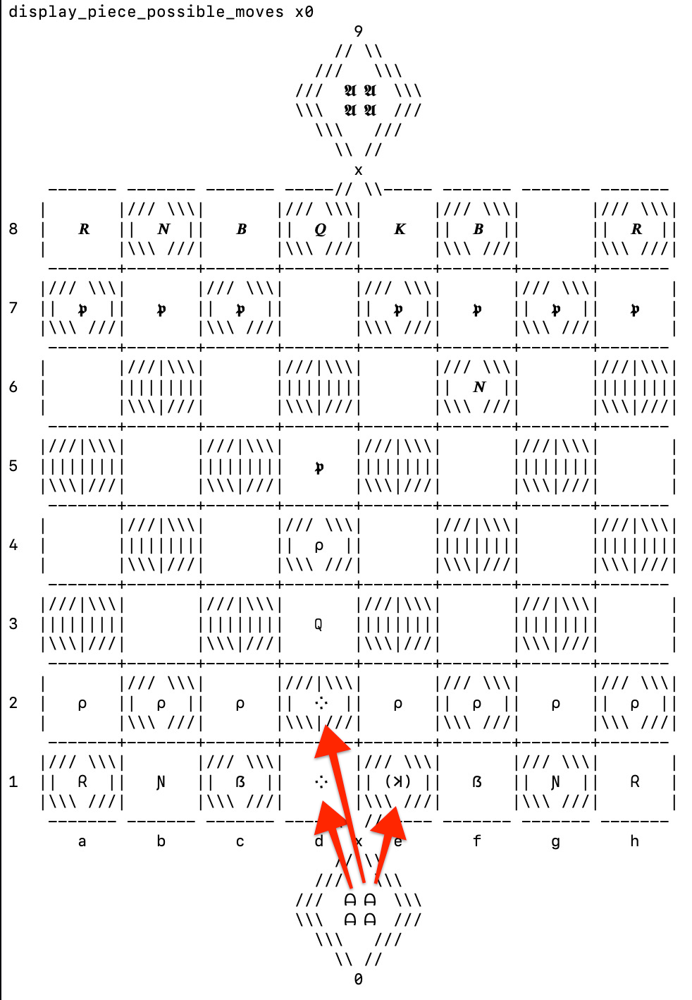

# EN-Chess
Proof of concept for a new chess variant!

The goal of creating this game is to modify chess in a way that is not too dissimilar from classic chess but also introduces some exciting new properties and possibilities. The emphasis is on changing a few assumptions of gameplay rather than requiring the user to learn patterns of movement of exotic pieces, thus having a short learning curve. The dimensions of the board are nearly unchanged.

The code in this repository also easily allows adding more variants, introducing pieces and properties as necessary--initially accommodating just standard and EN chess but opening the door to more in the future. A rudimentary representation of the board and available moves is included as a minimalist way to visually execute and explore gameplay. (Unicode required.) The main code could also serve as an "API" upon which GUI improvements would be possible.
  * For now, gameplay can be operated in a Python3 prompt/shell by calling simple Python functions to change the state of the game. To play with a friend, both players can sit at the same screen running the script, or one could screenshare remotely while the other player instructs the first on their moves to be entered.
  * Unfortunately, I found the chess-piece symbols to show up too small to use, so for greatest contrast I have selecting interesting abbreviation characters for each piece/color.

_I claim ownership of the ideas and associated code in this repository._

## Rules of EN Chess:
_Similar to classic chess, with the following changes:_
* **_x_ squares:** The board has two extra squares, _x0_ and _x9_, where _x0_ shares a corner with _d1_ and _e1_ and _x9_ shares a corner with _d8_ and _e8_. The _x_ squares do not share an edge with any other square (thus excluding any rook-like movement) but are considered diagonal-only to both of their neighboring _d_ and _e_ squares. _Note that this means Bishops can, in fact, switch their square color if they pass through an x square, and a Bishop or Queen can claim two diagonals of different square color while at this location._
* **Pawn promotion:** When a Pawn reaches the end of the board, it can only promote to a King (allowing the possibility of multiple Kings!) or an Auror, unless it forgoes promotion and waits at least one extra move as a Pawn, at which point it may expend a move to promote to any piece. If a Pawn captures a piece on an _x_ square, it must promote on the same move and can promote to any piece other than a Rook (which would be useless in an "x" square).
* **Aurors:** A new _Auror_ piece is introduced, starting with one per player in the _x_ square behind the army. Aurors move similarly to a King (one space in any of the eight directions) or identically to a Knight (they are quite mobile). However, they _cannot capture enemy pieces_ but rather exert influence in other ways:
  * **Penetration mode:** If a long-range piece (Bishop, Rook, or Queen) is adjacent (in any of the eight directions) to more friendly Aurors than enemy Aurors (e.g. only the starting Auror of the same army), then it gains the power of _Penetration_, where in a single move it can both capture and pass through one enemy piece, continuing in the same direction as far it chooses and potentially capturing one additional piece before stopping. Note that a Penetration-mode piece can check an enemy King if it is only blocked by one of its own pieces.
  * **Stunted mode:** If a long-range piece (Bishop, Rook, or Queen) is adjacent (in any of the eight directions) to more enemy Aurors than friendly Aurors (e.g. only the starting enemy Auror), then it loses its long-range abilities, only moving one square at a time in any of the directions it would normally move.
  * **King-Auror swaps:** Aurors can also _swap places with a King of the same army at any time_, often acting as an escape mechanism or perhaps to plant an Auror in a location that thwarts enemy movement. (In the case of multiple Kings or Aurors, _any_ Auror can swap places with _any_ King of the same army.)
* **Check and checkmate:** To accommodate the case of multiple Kings, the nature of check is adjusted according to the following rules:
  * **Legal moves:** If any King of the current player is in check, the only legal moves are those that _decrease the number of checked Kings_.
  * **Checkmate and Partial Checkmate:** If no such move is available, the result is dependent upon the number of Kings in check. If _all_ Kings of this player are in check, this is checkmate, and the checking player wins. If the number is any fewer, the checked player _loses a turn_, allowing the option of the checking player to _capture a King_ or make any other legal move. (Technically, two Kings could be captured in one move if there is a piece in Penetration mode!)
* _**TBD - Pawn movement** (possible additional change to encourage more frequent promotion to Kings/Aurors): Pawns can move either one or two spaces in the forward direction at any time rather than just on the second/seventh rank; two-space jumps are vulnerable to_ en passant _capture whenever an enemy pawn is immediately left or right of the final location._

## Getting started
The code does not require any installation after download. For non-Python-savvy users, an easy sequence of steps to get started is as follows.

1. Decide how to run the file. `macOS` should automatically come with Python 3. I think many versions of Linux as well. If the next steps reveal that you _do not_ have Python 3, a probably-no-hassle method is to use an online compiler (I found that this one works in "shell" mode: https://www.codingrooms.com/compiler/python3). Another method that should be pretty easy is just to install it: https://www.python.org/downloads/
2. Download the `enchess.py` file (or copy and paste into the online compiler, replacing any default code).
3. (probably not necessary for online compilers) On your console (_Terminal_ app on `macOS`; Command Prompt on Windows), navigate to the folder containing the file by entering `cd {folder name}`
  * e.g. on Mac: `{user} ~ % cd downloads`
4. Enter the Python 3 shell.
  * on Mac: `ericnordstrom@E983999-MAY19 downloads % python3` (similar on Windows; might be plain `python`--not sure)
  * Coding Rooms online compiler: Switch to "SHELL" and enter `python3`.
5. Import the game functions by entering `from enchess import *` in the Python shell (not needed if your online compiler of choice already ran the script)
6. See examples below for gameplay!

## Examples
### Initial board setup and display
_Initial commands and board state for EN chess variant shown here on my `macOS` Terminal - note that quadruple representation of x-square pieces is only a decorative effect for symmetry (and alluding to the strange nature of the_ x _squares); one square can contain only one piece, as usual.


## Turns and piece movement
Pieces can be moved via the `move` function, which prevents illegal moves, advances the game as necessary, and then displays the board from the perspective of the next player's side of the board. Pieces are specified by their current location on the board. For example, here are a few early moves that could be played and the resulting board:
```
>>> enc.move("d2", "d4")
 Pawn moved to d4.
 (display board)
 Black to move.
>>> enc.move("d7", "d5")
 Pawn moved to d5.
 (display board)
 White to move.
>>> enc.move("d1", "d3")
 Queen moved to d3.
 (display board)
 Black to move.
```
_Screenshot of next move:_


## Displaying possible moves
Optionally, the user can also display the possible moves of a given piece, shown below for a Queen and an Auror. Of course, one would abstain from this in serious gameplay.

_Queen attacking many squares - note `xpx` at `h7`, indicating the option to capture this enemy pawn._


_Auror options from starting position - note King in parentheses to indicate swap_

